# 异常记录表
---

## 审核流程的新增和编辑

## 批号追溯显示详情

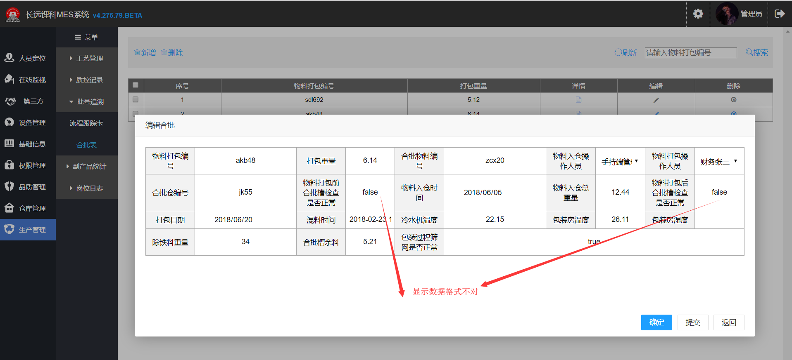

## 副产品检测新增
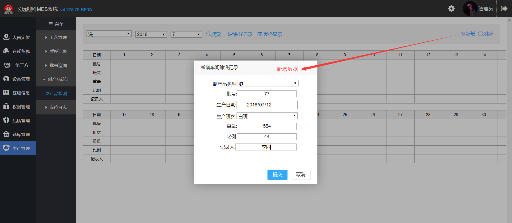
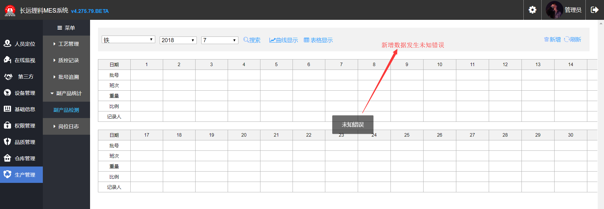
## 审核流程的编辑名称修改不成功

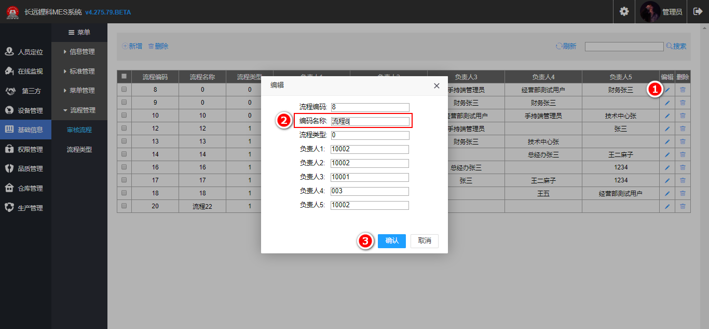

## 品质管理 > 检验化管理 > 数据导入 > 打开: 导入数据和取消按钮出现异常

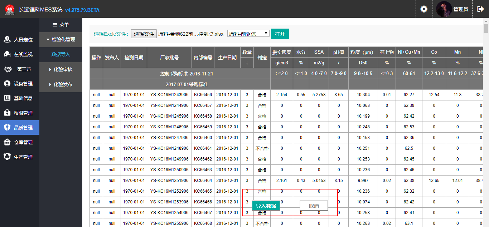

## 发布显示异常

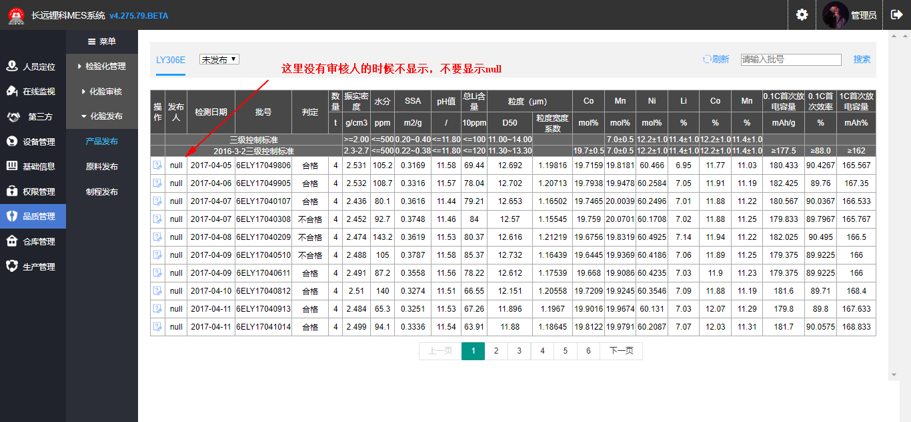

## 正常申请的新增页面

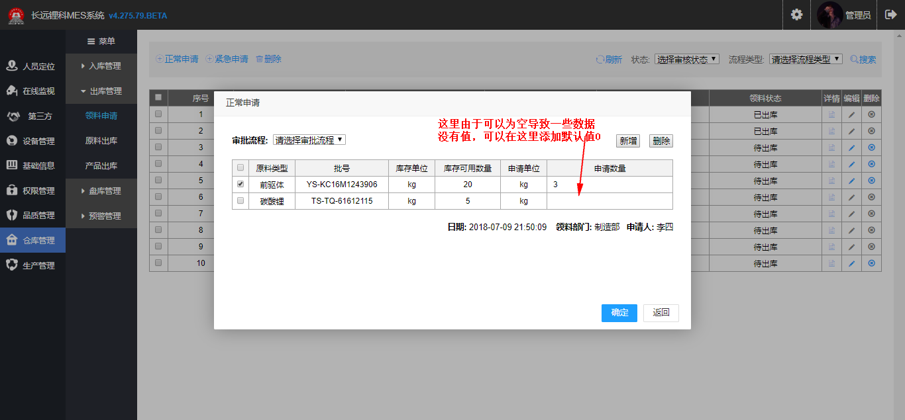

## 领料申请

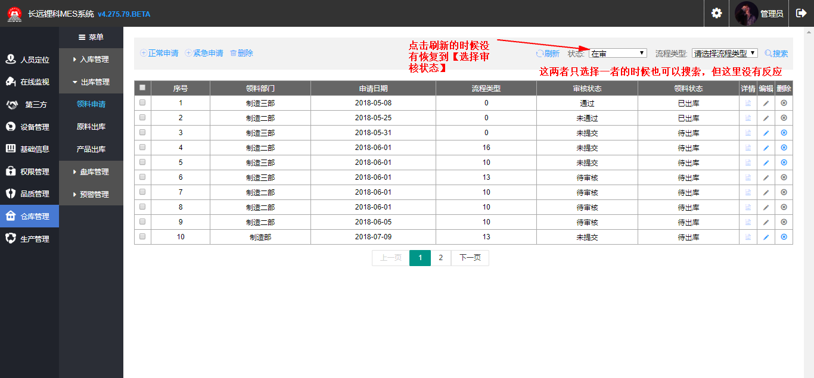

## 原料出库

## 产品出库 > 新增: 查询查不到内容

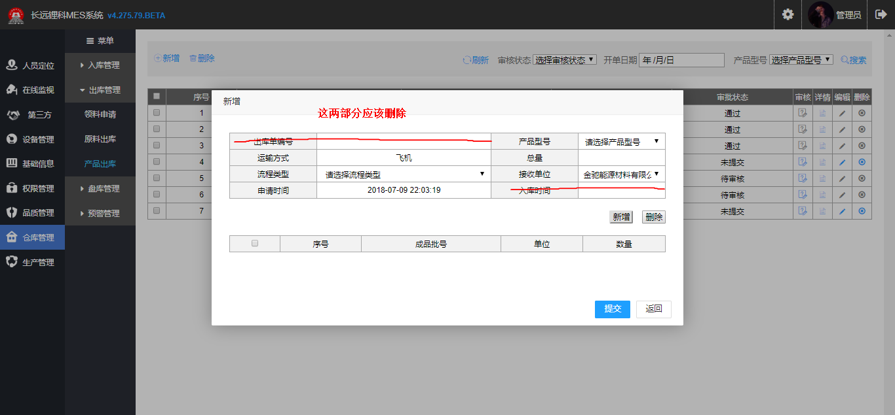

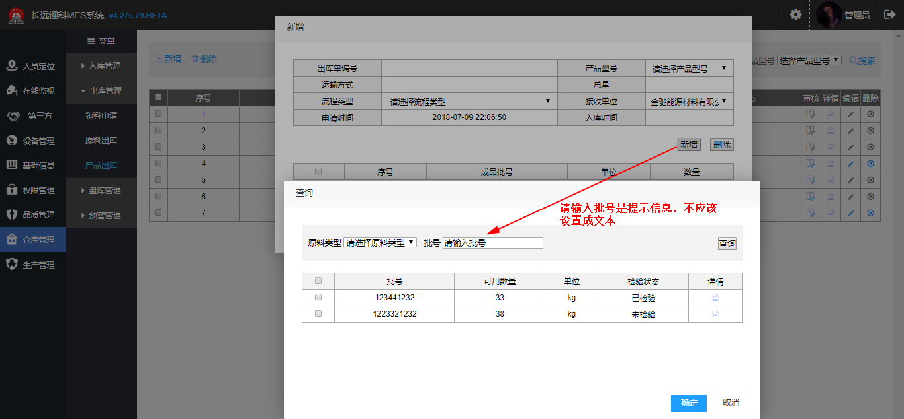

## 盘库审核

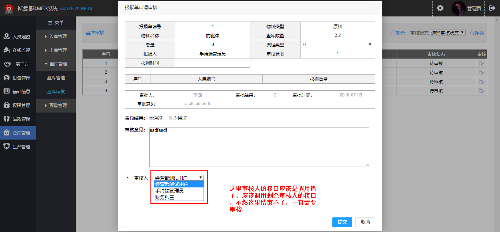
